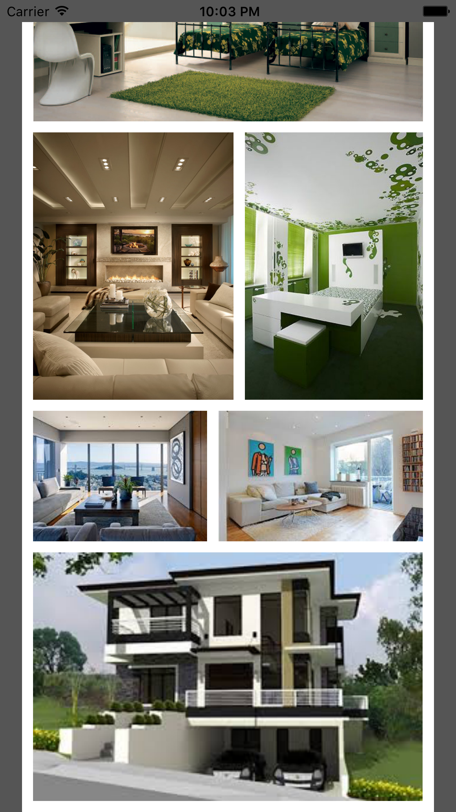

# JMCFlexibleCollectionLayout
> JMCFlexibleCollectionLayout is a iOS library that autoresizes collection view cells so it can display images without changing their aspect ratio. 

<!--//[![NPM Version][npm-image]][npm-url]-->
<!--//[![Build Status][travis-image]][travis-url]-->
<!--//[![Downloads Stats][npm-downloads]][npm-url]-->

The collection view is a great UI element but it doesn't handle elements with various content sizes elegantly. But don't you fear that's where JMCFlexibleCollectionLayout comes to rescue. Based on customizable paramaters like spacing between cells, margins, and maximum row height calculates and displays a collection view grid.  


## Installation

iOS:

```sh
copy JMCFlexibleLayout.swift and JMCFlexibleDataSource.swift to your project 
```

## Usage example

A few motivating and useful examples of how your product can be used. Spice this up with code blocks and potentially more screenshots.





## Development setup

Describe how to install all development dependencies and how to run an automated test-suite of some kind. Potentially do this for multiple platforms.

```sh
make install
npm test
```

## Release History

* 0.1 July 2016
    * Candidate for release

## Meta

Your Name – [@appzzman](https://twitter.com/appzzman) – janusz@izotx.com

Distributed under the BSD license. See ``LICENSE`` for more information.

[https://github.com/yourname/github-link](https://github.com/dbader/)

<!--[npm-image]: https://img.shields.io/npm/v/datadog-metrics.svg?style=flat-square-->
<!--[npm-url]: https://npmjs.org/package/datadog-metrics-->
<!--[npm-downloads]: https://img.shields.io/npm/dm/datadog-metrics.svg?style=flat-square-->
<!--[travis-image]: https://img.shields.io/travis/dbader/node-datadog-metrics/master.svg?style=flat-square-->
<!--[travis-url]: https://travis-ci.org/dbader/node-datadog-metrics-->
